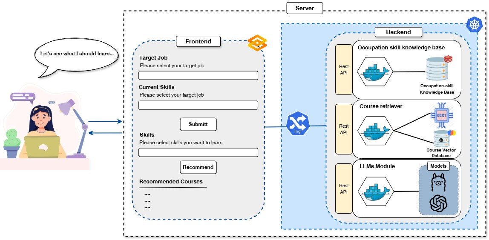

# CRAFT: A Course Recommendation Advisor for Future Talent

Repository of the ECTEL'20 paper: [CRAFT: A Course Recommendation Advisor for Future Talent]()

CRAFT web application: https://escoai.myedulife.dbis.rwth-aachen.de/



## Dataset Preparation

### 1. Course Dataset

Our course data is sourced from [**Udemy**](https://www.udemy.com/developers/affiliate/) and [**Arbeitsagentur (AW)**](https://github.com/bundesAPI/weiterbildungssuche-api/). For detailed API information, please refer to the respective websites. Our tool was developed based on the versions available at the time. If there have been any API updates since then, please make the necessary adjustments according to the current API specifications.

```
python ./Dataset/Course_dataset/dataset.py --dataset {'AW' or 'Udemy'} --filepath {path to save the dataset}
```
The final output is `Udemy_courses.csv` or `AW_courses.csv` in the filepath


### 2. Skill Entities Annotation Dataset

First sample the course descriptions from Course dataset, and generate jsonl files for NER annotation

```
python ./Dataset/Skill_entities_annotation_dataset/preprocess.py --paths aw_courses.csv udemy_courses.csv --fractions  [0.8,0.2] --num_files 8 filepath {path to save the jsonl files}
```

- `--paths`: paths of course information from Course dataset for sampling the course descriptions for NER annotation
- `--fractions`: sample fraction of each file
- `--num_files`: number of output jsonl files

Use Prodigy tool to annotate NER dataset. Since Prodigy is a paid tool, please refer to the relevant information from https://prodi.gy/ and install it before running the following code. We are using version 1.14.14 for your reference.


```
prodigy ner.manual ner_skill de_dep_news_trf ./course_description_1.jsonl --label SKILL
```
We offer a labeled dataset [**wt3639/Skill_Annotation_Dataset**](https://huggingface.co/datasets/wt3639/Skill_Annotation_Dataset)

### 3. Occupation-Skill Knowledge Base

Our occupation-skill knowledge base is built on two sources: [**ESCO**](https://esco.ec.europa.eu/en/use-esco/download) and the [**Arbeitsagentur Berufenet (BA)**](https://github.com/bundesAPI/berufenet-api) API. For detailed API information, please refer to the respective websites. Our tool was developed based on the versions available at the time. If there have been any API updates since then, please make the necessary adjustments according to the current API specifications.

### 4. Groud Truth Occupation Course Dataset

```
python ./Dataset/Groud_truth_occupation_course_dataset/dataset.py --filepath {path to save the dataset} --model_name {skill extractor model name} --fraction [0.8,0.1,0.1] --random_seed 42
```

- `--fractions`: fraction of training, validation and test set

The final output is `occupation_course_info.csv` , `course_info.csv`, `train_set.csv`,`validation_set` and `test_set.csv` in the filepath, also the file include in `filepath/train` and `filepath/validation` for finetuning Course Retriever and LLM ranker


### 5. Synthetic Recommendation Explanation Dataset

```
python ./Dataset/Synthetic_recommendation_explanation _dataset/dataset.py --LLM-key {OpenAI api key} --occupation_course_data {path of Groud Truth occupation course dataset} --filepath {path to save the dataset}
```
### 6. Education Corpora

```
python ./Dataset/Education_corpora/dataset.py --files {All the csv files relate to Education domain} --ouput {path for ouput file}
```

## Model Training

Please run the following model training code on a machine equipped with suitable GPUs. For reference, our configuration includes 4 NVIDIA H100 GPUs with 96 GB HBM2e each, 512 GB of memory, and 48 CPU cores.

### 1. BERT Domain Pretraining

```
torchrun --nproc_per_node {number of gpus} -m ./Model_training/BERT_domian_pretraining/run.py \
--output_dir {output path} \
--model_name_or_path {base model} \
--train_data {domain corpora jsonl file} \
--learning_rate 2e-5 \
--fp16 \
--num_train_epochs 5 \
--per_device_train_batch_size 16 \
--dataloader_drop_last True \
--max_seq_length 512 \
--logging_steps 10 \
--dataloader_num_workers 8 \
--save_steps 2000
```

We offer a trained model [**wt3639/EduGBERT**](https://huggingface.co/wt3639/EduGBERT)

### 2. BERT-base Skill Extractor

```
prodigy hf.train.ner ner_course_train,eval:ner_course_test {output path} \
--epochs 100 \
--model-name {domain pretrained model} \
--batch-size 32 \
-lr 5e-6 
```

We offer a trained model [**wt3639/NER_skill_extractor**](https://huggingface.co/wt3639/NER_skill_extractor)

### 3. BERT-base Course Retriever

```
torchrun --nproc_per_node {number of gpus} -m ./Model_training/BERT_base_course_retriever \
--output_dir {output path} \
--model_name_or_path {domain pretrained model} \
--train_data {training set} \
--learning_rate 1e-5 \
--fp16 \
--num_train_epochs 100 \
--per_device_train_batch_size 4 \
--dataloader_drop_last True \
--normlized True \
--temperature 0.02 \
--query_max_len 360 \
--passage_max_len 512 \
--train_group_size 15 \
--negatives_cross_device \
--logging_steps 10 \
--save_steps 1000 \
--query_instruction_for_retrieval
```
We offer a trained model [**wt3639/EduGBERT_CourseRec**](https://huggingface.co/wt3639/EduGBERT_CourseRec)

### 4. LLM Ranker

```
python -u ./Model_training/LLM_ranker/finetune_rec.py \
                    --base_model {base LLM model such as Meta-Llama-3-8B-Instruct} \
                    --train_data_path {training set} \
                    --val_data_path {validation set} \
                    --output_dir {output path} \
                    --batch_size 16 \
                    --micro_batch_size 8 \
                    --num_epochs 4 \
                    --learning_rate 1e-4 \
                    --cutoff_len 1500 \
                    --lora_r 16 \
                    --lora_alpha 16\
                    --lora_dropout 0.05 \
                    --lora_target_modules '[q_proj,v_proj,k_proj,o_proj,gate_proj,up_proj,down_proj]' \
                    --train_on_inputs \
                    --group_by_length 
```
We offer a trained model [**wt3639/Llama-3-8B-Instruct_CourseRec_lora**](https://huggingface.co/wt3639/Llama-3-8B-Instruct_CourseRec_lora)

### 5. LLM Explanation Generation

```
python -u ./Model_training/LLM_explanation_generation/finetune.py \
                    --base_model {base LLM model such as Meta-Llama-3-8B-Instruct} \
                    --train_data_path {training set} \
                    --val_data_path {validation set} \
                    --output_dir {output path} \
                    --batch_size 4 \
                    --micro_batch_size 2 \
                    --num_epochs 30 \
                    --learning_rate 1e-4 \
                    --cutoff_len 2000 \
                    --lora_r 16 \
                    --lora_alpha 16\
                    --lora_dropout 0.05 \
                    --lora_target_modules '[q_proj,v_proj,k_proj,o_proj,gate_proj,up_proj,down_proj]' \
                    --train_on_inputs \
                    --group_by_length 
```
We offer a trained model [**wt3639/Lllama-3-8B-instruct-exp-adapter**](https://huggingface.co/wt3639/Lllama-3-8B-instruct-exp-adapter)

## Model Evaluation
```
python -u ./Model_evaluation/evaluation.py \
                    --course_data {filepath for all course information file} \
                    --test_data {test set} \
                    --course_retriver_model {path or name for BERT-base course retriever model} \
                    --LLM_model {path or name of Large language model such as Meta-Llama-3-8B-Instruct} \
                    --lora_rec_adpater {path or name of LLM ranker model} \
                    --hf_token {huggingface token}\
                    --result_path {folder path for saving the result}\
                    --top_k {top k candidates retrieved from all courses defualt 10}
```
## System Implement

```
cd ./System_implement
docker-compose up
```

## Note

The BERT Domain Pretraining and BERT-base Course Retriever models training codebase is adapted from [**FlagEmbedding**](https://github.com/FlagOpen/FlagEmbedding) 

The LLM Ranker and LLM Explanation Generation models training codebase is adapted from [**TALLRec**](https://github.com/SAI990323/TALLRec) 

Thanks for their contributions.

## Citation

```tex


```
